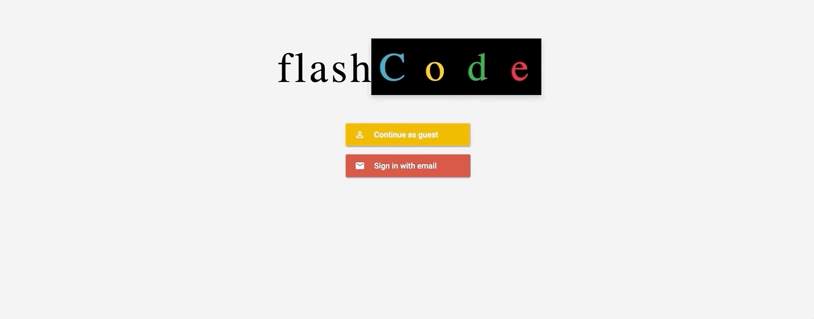
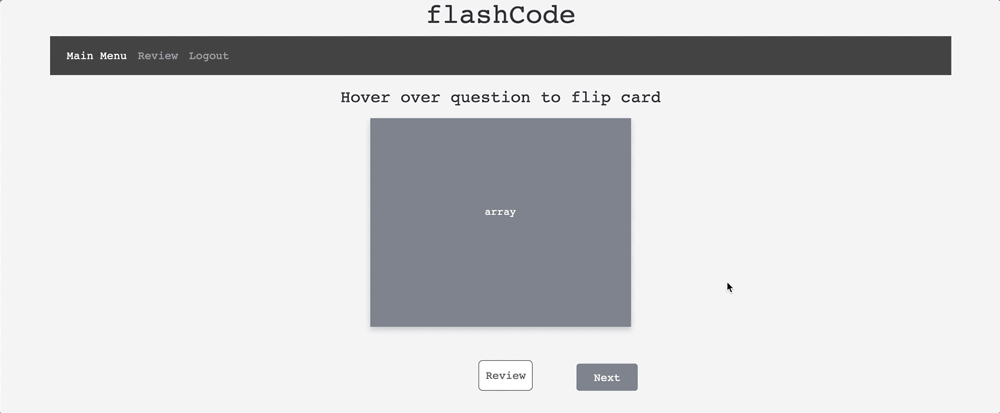

# flashCode

**Purpose:** 

This website was created to help individuals study common programming terms using virtual flashcards. These flashcards are meant to provide a more convenient alternative to the conventional pen and paper method. 

**How to use:**

Users have the option to register with their email address or log in as a guest. Once logged in, the user has access to six decks of cards, each representing a different programming language and vocabulary. When a user selects a card deck, they are redirected to that specific deck. The card face shown presents the term and when the user hovers over the card, the corresponding definition and example is revealed. The user will also be presented with book resource options related to the programming language as well as previous, next, and review buttons. The previous and next buttons help the user access the other cards in the deck. When clicked, the review button saves the current card to the review tab located on the navigation bar. The user can access their saved cards on the review page, from here they can choose to delete the cards they no longer need to study. 

**Features:** 

HTML, CSS, Bootstrap, JavaScript, jQuery, Firebase, Google Books API

**Live Link:** 

(Works best in Chrome or Firefox)
          
1) http://gmpflashcode.surge.sh (Static login screen with unique title font) 

2) http://flashcode.surge.sh (Alternate styling with jquery based loginscreen animation)

**Project Contributors:** Tim Goens, Summer Feilers, Ashley Mello

**Login:**

**Card Flipping Animation:** 

